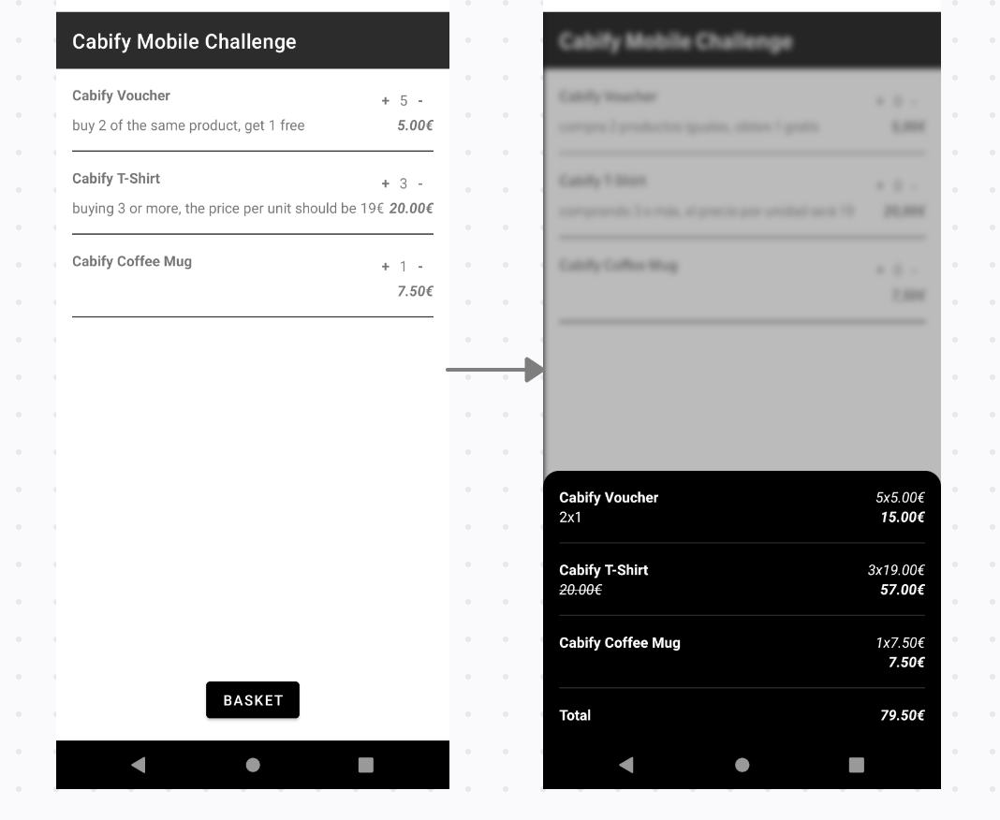
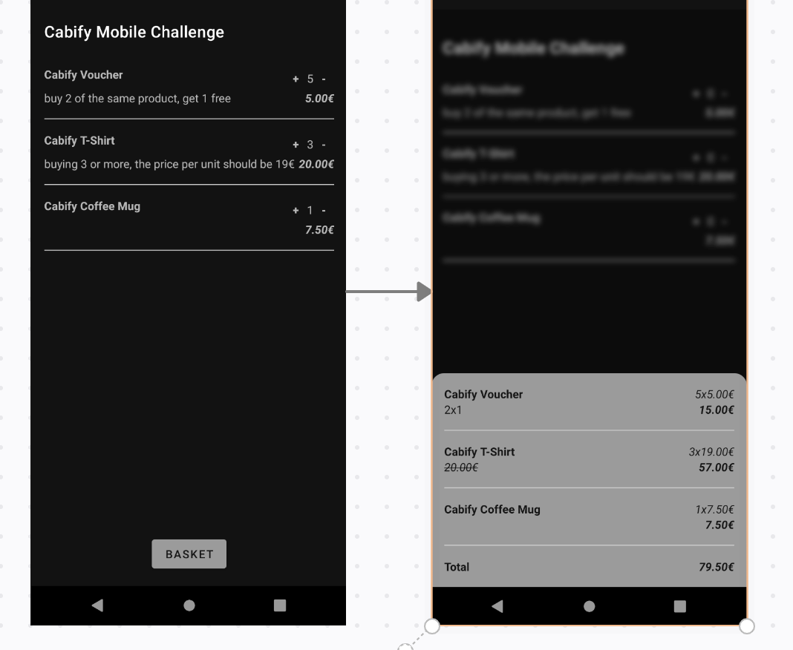
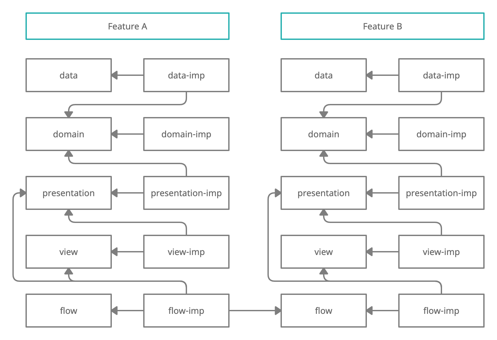
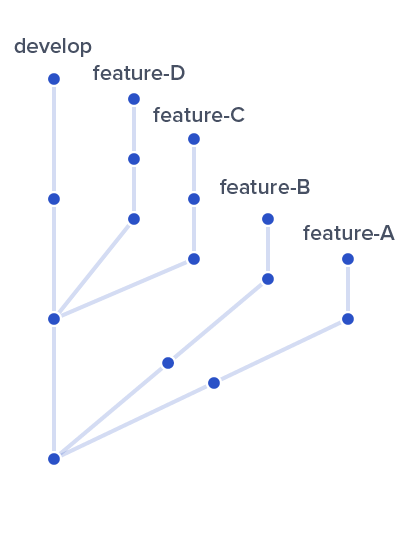
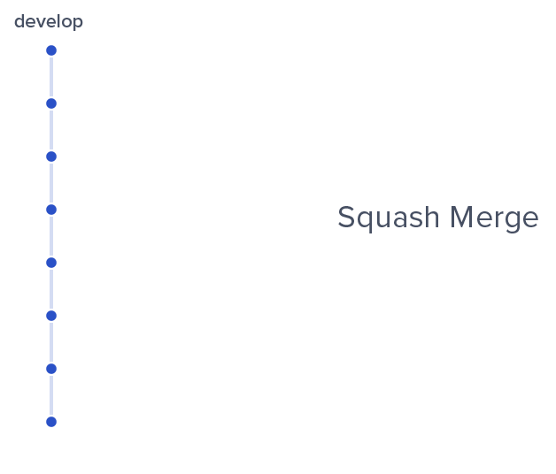

# Cabify Mobile Challenge by Iosu Lizarraga Madinabeitia

## Summary

Cabify Mobile Challenge is an app that a user can pick products from a list and checkout them to get the resulting price.

## App Flow

## App structure description

The app was made using Clean Architecture with MVVM pattern and reactive components. The app modularization is done thinking on improve the app time compilation and the fast bug detection. The modules are split in features and in CA layers as it can see in the following scheme:

## Modularization structure

The responsibility to know the other layers, are in the -imp modules; the abstractions must not in any case be aware of other modules.

## Modules

#### Data module
Provide, send or keep the data info that the app needs to work.
I added here the discounts to be easy to change them, inside DiscountDataDataSourceImp, and I combine them with the description test inside DiscountRepository.

#### Domain module
The business logic.
As the discounts are a product requirement, I added here the combination between products and discounts, inside GetArticlesStateUseCase, creating a new data class called articles.

#### Presentation module
The viewModels. I created viewModels for each fragment and viewHolder if needs.

#### View module
The views, binders, and the definitions of router.

#### Flow module
The responsible to allow navigation between features and back navigation.

## Packaging
The packaging structure is based in four parts: app package path definition + feature + layer + component. For example:
com.ilizma.checkout.presentation.viewmodel.

## Naming
The class naming is based in the feature division, the abstracted classes are called X.kt and the implementation classes are called XImp.kt.

## GitFlow

I usually use Squash and merge for features, so that they stay as a single commit in develop, and use Merge to merge develop into master, so we have a very clean git and it's much easier to follow the flow of it.
Github allows us to restore branches that have already been Squash and merged, so we don't lose the flow of commits for that feature.

In this case, I do a Merge.

### Important used libraries
- DaggerHilt: To do the dependency injection.
- RxKotlin, RxAndroid and RxJava: To get/send data asynchronously.
- FragmentScenario and espresso: To do the instrumentation tests.
- Mockk: A Kotlin library to mock the objects on Tests.
- JUnit: To do unit the tests.
- NavigationComponent: To navigate between views.
- Retrofit and okhttp: To manage network.
- Moshi: To manage Json.
- Chucker: To see the network in a separated screen.
- Shimmer: To do the loading views.
- CustomActivityOnCrash: To see crashes easily in a new screen.

### Annotation
This project contains Unit Test for almost all classes, and some Fragment and Binder instrumentation tests.

